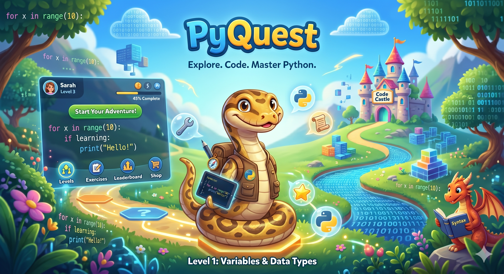

<p align="center">
  
</p>

# PyQuest

> Python lessons that read themselves aloud, run your code in a sandbox, and yell at you when you forget a comma.

[](https://www.python.org/downloads/)
[](CHANGELOG.md)
[](LICENSE)

PyQuest teaches Python from zero. Ten hand-written chapters, a sandboxed code playground, an offline voice that reads each lesson, and an optional local AI tutor that can hint, explain, or roast you. Everything runs on your computer — no accounts, no subscriptions, no telemetry.

---

## ✨ What's in the box

- **10 chapters** from "what is programming?" to lists, with auto-checks, hints, and quizzes
- **Offline neural voice** ([Kokoro](https://github.com/thewh1teagle/kokoro-onnx), 28 voices, CPU-only)
- **Offline voice commands** ([Vosk](https://alphacephei.com/vosk/)) — say *"run"*, *"check answer"*, *"next"*
- **Optional AI tutor** via local [LM Studio](https://lmstudio.ai/) with three moods: Friendly / Strict / Drill Sergeant
- **Sandboxed runner**, XP & streaks, dark & light themes

---

## 🚀 Quick start

Tested on **Windows 11, Python 3.11**. Works on macOS and Linux too.

```bash
git clone https://github.com/AhmedBoSaad/PyQuest.git
cd pyquest
python -m venv .venv
.venv\Scripts\activate          # Windows
# source .venv/bin/activate     # macOS / Linux
pip install -e .
python run.py                   # or just: pyquest
```

On first launch, a **welcome wizard** offers three optional setup steps:

1. **Voice (~340 MB)** — download Kokoro so lessons can read themselves aloud.
2. **Voice commands (~50 MB)** — download Vosk for offline speech recognition.
3. **AI tutor** — point at LM Studio.

Every step can be skipped. The core app works without any of them.

---

## 🤖 AI Tutor (optional)

PyQuest can chat with a **local LLM** via [LM Studio](https://lmstudio.ai/). No API keys, no internet, no cost.

1. Install LM Studio and pull a chat model (Llama 3.2 3B, Qwen 2.5 7B — whatever fits your machine).
2. In LM Studio: **Local Server → Start Server**.
3. In PyQuest: **⚙️ Settings → AI Tutor → click "Refresh"** to fetch loaded models, then pick one.
4. Tick *"Let the AI tutor jump in automatically"* if you want proactive help on wrong answers and errors.
5. In any lesson, click **🤖 Ask tutor** to chat.

The tutor sees your current lesson, your live-typed code, and your last error. It will not write the full solution. The **Drill Sergeant** persona escalates as you accumulate mistakes inside one lesson — and resets when you start a new one. Edit personas in [pyquest/data/personas.json](pyquest/data/personas.json).

---

## 🎤 Voice commands

Toggle the mic in any lesson (or press **Ctrl+Space**), then say:

| Say | Action |
|---|---|
| "run" | Run your code |
| "check answer" | Run + auto-check |
| "show hint" | Reveal next hint |
| "next" | Continue / next question / next chapter |
| "go back" | Back to chapter index |
| "try again" | Reset the editor |
| "explain the error" | Tutor explains the last stderr |
| "ask tutor" | Open the AI tutor drawer |
| "option B" / "the third one" / "two" | Pick a quiz answer |

All offline. Mic is OFF by default.

---

## ➕ Adding a lesson

Drop a JSON file into `pyquest/data/lessons/` with a higher `order` than the existing ones:

```json
{
  "id": "16_my_lesson",
  "order": 16,
  "title": "My new lesson",
  "xp_reward": 50,
  "objective": "One-line objective.",
  "explanation_md": "## Markdown body...",
  "exercise_prompt": "Print exactly: hi",
  "starter_code": "# write your code\n",
  "hints": ["First hint.", "Second hint."],
  "expected_output": "hi",
  "check": {"type": "stdout_equals", "value": "hi"},
  "quiz": [{"q": "...", "options": ["a","b","c","d"], "answer": 1, "explain": "..."}]
}
```

Lessons are validated on load with helpful errors for typos. Check types: `stdout_equals`, `stdout_contains`, `regex`, `code_contains`, `none`.

---

## 🛡 Sandboxing

User code runs in a separate Python process with an AST pre-check (blocks dangerous imports, `eval`, `open`, dunder escapes) and a 5-second timeout. **This is a learning sandbox, not a security boundary** — don't paste untrusted code.

---

## 🧪 Tests

```bash
pip install -e ".[dev]"
pytest
```

CI runs `pytest` and `ruff` on every push (see `.github/workflows/ci.yml`).

---

## 🤝 Contributing

PRs welcome. See [CONTRIBUTING.md](CONTRIBUTING.md) for the dev setup. Bugs → [Issues](../../issues). The **Report a bug** button in Settings pre-fills the form with your recent log tail.

---

## 📄 License

[MIT](LICENSE).

Built with [Kokoro-ONNX](https://github.com/thewh1teagle/kokoro-onnx), [Vosk](https://alphacephei.com/vosk/), [LM Studio](https://lmstudio.ai/), and [PySide6](https://doc.qt.io/qtforpython-6/). 🐍
